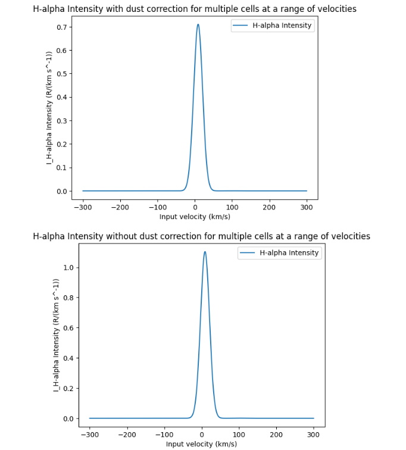
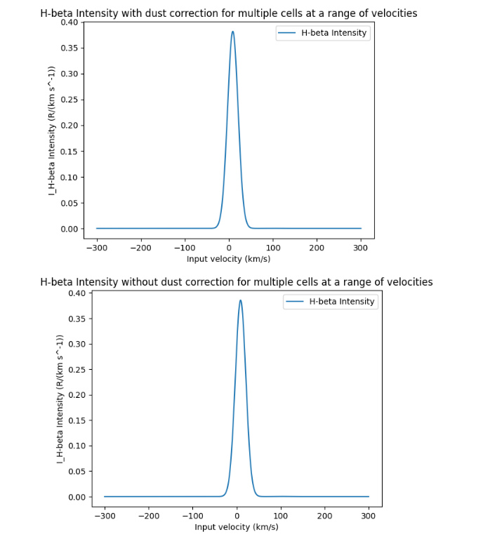
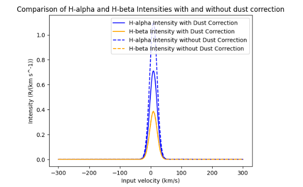
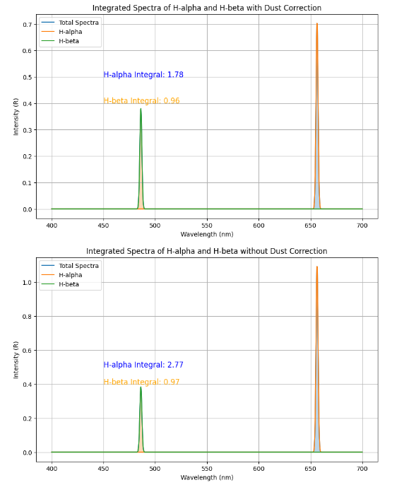

Creating Intensity Graphs with `pyonized`
======================================

The :class:`~pyonized.BalmerLines` class has multiple methods for plotting intensity graphs
with the help of matplotlib.

    >>> import pyonized

    >>> # Creating an instance of the class
    >>> length = 100
    >>> maxdist = 2 * u.kpc
    >>> ncells = 100
    >>> dl = 46 * u.pc
    >>> l = 6 * u.deg
    >>> b = 5 * u.deg
    >>> # Note: velocities is defaulted to be np.linspace(-300, 300, 1000)

    >>> synthetic_line = BalmerLines(length, dl, l=l, b=b, dustmap_class = BayestarQuery)

The example above will create an instance of the class. You can decide which graphs you would like by doing the following codes.

Plotting intensities with and without dust corrections:

    >>> # Plot H-alpha Intensity with dust correction for multiple cells at a range of velocities
    >>> synthetic_line.plot_intensity('ha', extinction_correction=True)
    >>>
    >>> # Plot H-alpha Intensity without dust correction for multiple cells at a range of velocities
    >>> synthetic_line.plot_intensity('ha', extinction_correction=False)

    >>> # Plot H-beta Intensity with dust correction for multiple cells at a range of velocities
    >>> synthetic_line.plot_intensity('hb', extinction_correction=True)
    >>>
    >>> # Plot H-beta Intensity without dust correction for multiple cells at a range of velocities
    >>> synthetic_line.plot_intensity('hb', extinction_correction=False)

Plotting a comparison graph:

    >>> # Plot comparison of H-alpha and H-beta intensities
    >>> synthetic_line.plot_comparison(velocities)

Plotting integrated spectra graphs:

    >>> # Plot graphs of the emission lines' integrated spectra
    >>> synthetic_line.plot_integrated_spectra(extinction_correction=True) # with dust correction
    >>> synthetic_line.plot_integrated_spectra(extinction_correction=False) # without dust correction

